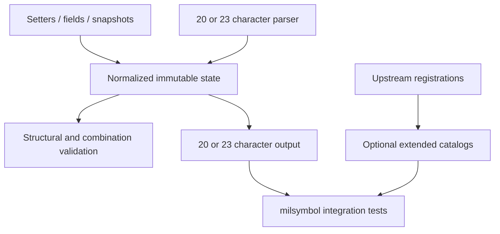

# feat: Add opt-in SIDC positions 21–23

## Overview

Extend the immutable builder with the three additional positions consumed by
milsymbol: modifier-1 extension, modifier-2 extension, and frame shape.
Keep existing 20-character output unchanged. Explicit extension use produces
23 characters, not 30.

The user confirmed this scope during planning. This is a plan only; no library
implementation or test execution is part of this work session.

| Builder state | Output | Rendering intent |
| --- | --- | --- |
| No extension | 20 characters | Existing behavior, all editions |
| Explicit zero extension | 23 characters ending `000` | Same rendering; preserve representation |
| Nonzero modifier extension | 23 characters | Select a three-digit modifier |
| Frame shape selected | 23 characters | Override shape; `A` means no frame |

---

## Requirements Trace

- R1. Encode positions 21 and 22 as the hundreds digits of modifier 1 and 2;
  retain their final two digits at positions 17–18 and 19–20 respectively.
- R2. Encode position 23 with named frame-shape values, including `0` (default),
  `1`–`9` (shapes), and `A` (no frame). Explain that this one position is not
  digits-only.
- R3. Preserve 20-character defaults, existing setters, old snapshot shape,
  immutable behavior, warning callbacks, and zero runtime dependencies.
- R4. Support exact parse/render and snapshot reconstruction for both 20- and
  23-character forms, including explicit zero extensions.
- R5. Make extended modifier membership discoverable through optional catalogs
  without introducing catalog checks into the core builder.
- R6. Prove actual modifier and frame-shape rendering with milsymbol for
  MIL-STD-2525E and APP-6 E; document deliberate limits for other editions.

---

## Scope Boundaries

- No automatic version-to-length rule and no 30-character zero padding.
- No positions 24–30, country-code fields, full Set C compliance claim, or
  letter-based SIDC support.
- Do not accept 21-, 22-, or 30-character inputs in this feature. Milsymbol's
  permissive parser is not the builder's supported interchange contract.
- No runtime dependency on milsymbol or generated catalogs.
- No changes to milsymbol's renderer, active upstream checkout, or local links.
- No exhaustive semantic enum for extended modifiers; named frame shapes are
  included because their bounded values are directly defined by the parser.

---

## Context and Research

### Existing patterns

- `src/sidc.ts`: frozen fields; setters delegate through `with()` and the
  constructor; `parse`/`tryParse` currently require exactly 20 ASCII digits.
- `src/validate.ts`: immediate malformed-field errors, deferred combination
  problems, and optional strict-mode exceptions. Raw modifier membership is
  intentionally not checked.
- `src/enums.ts` and `src/index.ts`: literal-code constants and explicit public
  exports.
- `src/catalog.ts`: optional membership-only entry point; existing modifier
  arrays promise two-digit codes.
- `scripts/generate-catalogs.mjs`: extracts two-digit modifier registrations;
  combines unguarded common registrations with per-set tables.
- `test/sidc.test.ts` and `test/catalog.test.ts`: Node test runner, literal
  offsets, immutability, parsing, warnings, sorted/frozen catalog checks.
- No matching requirements document or institutional learning document exists
  under `docs/`; the source is the conversation and confirmed scope.

### Upstream evidence and limits

Reference: milsymbol commit `59d068792e3202050b93ec2c664291b8e3d66b77`, inspected
in the isolated suspect-fix clone, locally labelled 3.0.5. That label is not a
published dependency version and must not be used as a registry requirement.
Upstream paths below refer to the milsymbol repository, not this repository.

- `src/numbersidc/metadata.js`: position 21 precedes the two modifier-1 digits;
  position 22 precedes modifier 2. Missing values default to zero.
- `src/symbolfunctions/icon.js`: zero extension uses the two-digit lookup;
  nonzero extension uses the complete three-digit lookup. Missing registration
  makes the rendered icon invalid.
- `src/numbersidc/sidc/common.js`: common three-digit registrations include
  modifier 1 `100` (UAV), `105` (VTOL), and modifier 2 `100` (Airborne).
  These have no symbol-set guard, but availability still depends on the loaded
  upstream bundles. Registration is not proof of universal standard validity.
- `src/numbersidc/metadata.js`: frame-shape codes `1`–`9` override metadata for
  edition E; the `A` no-frame branch is outside that edition guard. Versions
  `13` and `14` select E, while `10`, `11`, `12` select D.
- Milsymbol accepts short extension tails. We intentionally expose a complete
  three-position tail rather than reproduce every permissive input form.

Earlier conversation assertions about extensions being specific to a few sets,
about all frame-shape handling being E-gated, and about full standards compliance
were too broad. This plan relies on the specific parser behavior above, not those
assertions. No external standards-compliance claim is inferred from the parser.

---

## Key Technical Decisions

These are proposed implementation contracts, subject to plan review before work.

| Decision | Rationale / interaction |
| --- | --- |
| Optional extension record in fields and snapshots | Absence means 20 characters; presence means exactly 23, even if all values are zero. |
| Keep existing modifier setters two-digit | Avoid silently changing established method validation and field meanings. |
| Add complete-code extended-modifier setters | Callers supply `100` or `105`; helpers split the hundreds digit into the tail and final two digits into existing slots. |
| Separate extended catalog APIs | Preserve the documented two-digit return contract of existing catalog functions. |
| Structural core validation only | Unknown but well-formed codes remain encodable, as today; catalog membership and rendering validity stay distinct. |

### State and API behavior

- Add an optional `extension` record carrying single-character
  `modifier1Extension`, `modifier2Extension`, and `frameShape` values. Normalize
  absent members to `0`; freeze/copy the nested record, not just its parent.
  New fields are optional in public records so old callers remain compatible.
- Add `extendedModifier1` and `extendedModifier2` operations taking a complete
  three-digit code; preserve the opposite modifier and frame shape. A leading
  zero is allowed: `005` is explicitly extended, but selects ordinary modifier
  `05` in milsymbol.
- Existing two-digit modifier setters reset their own extension digit to `0`
  if an extension exists, retaining its presence, opposite digit, and shape.
  This prevents a stale hundreds digit from surviving an intentional replacement.
- Add a frame-shape setter and exported `FrameShape` constant/type. Map upstream
  `0` default, `1` space, `2` air, `3` land unit, `4` land equipment/sea surface,
  `5` installation, `6` dismounted individual, `7` subsurface, `8` activity/event,
  `9` cyberspace, `A` no frame. Treat labels as upstream selectors, not a promise
  that each metadata flag is set intuitively (notably selector `9`).
- Setting any extended field activates a complete tail. Provide explicit
  `withoutExtension` removal: drop hundreds digits/shape, keep both low-digit
  slots. Document that this can select different ordinary modifiers, so it is
  intentional data loss rather than a lossless format conversion.
- `with()` continues to patch raw encoded fields: low-digit changes retain the
  existing extension; providing an extension record replaces that record and
  defaults its omitted members. Fluent modifier setters additionally perform
  their documented high-digit reset. Explicit undefined follows the existing
  constructor normalization pattern; use `withoutExtension` for clear intent.
- Snapshots without extensions remain byte-for-byte equivalent in JSON shape.
  Extended snapshots include the complete tail record; reconstructing through
  fields/`with()` retains its presence.
- Equality compares encoded representation: a 20-character code is not equal to
  the corresponding 23-character code ending `000`, despite identical rendering.
  Clone, equality, and problem inspection must not render or emit warnings.

### Validation and edition policy

- Only ASCII digits in positions 1–22; only `0`–`9` or uppercase `A` at 23.
  Reject lowercase `a`, whitespace, Unicode digits, nonstrings, malformed nested
  records, and incorrect widths consistently across every construction path.
- Adopt a conservative supported-feature policy: meaningful extension values
  are supported for known E versions `13` and `14`. For known D versions `10`,
  `11`, and `12`, emit a stable combination problem when either high modifier
  digit is nonzero or frame shape is not `0`. Strict mode throws at render time;
  warning mode preserves and emits the requested code.
- This D warning is a deliberate builder policy, not a claim that milsymbol
  refuses such codes: upstream may render common modifiers or `A` on D when
  bundles are loaded. Explicit all-zero tails do not warn on D.
- Preserve unknown-version escape behavior: report the existing unknown-version
  problem, retain tail data, and make no E-support promise.
- Changing standard/version never clears extension data silently. Re-evaluate
  combination problems using the final version, preserving setter order freedom.
- Parse remains structural: it can construct a combination-invalid builder;
  strict-mode rendering, not parsing, raises combination errors, as today.
- Core acceptance of `199` does not imply milsymbol can render it. Optional
  membership checks and renderer validity remain separate responsibilities.

---

## Implementation Units

- [x] U1. **Extend the immutable field and serialization contract**

**Goal:** Implement positions 21–23 consistently across every builder surface.

**Requirements:** R1–R4, R6. **Dependencies:** None.

**Files:** Modify `src/enums.ts`, `src/index.ts`, `src/validate.ts`,
`src/sidc.ts`; existing characterization in `test/sidc.test.ts`, new extension
coverage in `test/sidc-extension.test.ts`.

**Approach:** Follow the state/API decisions above. Centralize normalization and
validation; keep codec splitting and joining consistent with the raw low-digit
fields. Extend the parser to exactly 20 or 23 characters, preserving tail
presence rather than trimming zeros. Start with characterization of old snapshots,
error timing, and equality before adding the extension cases.

**Patterns:** Existing constructor/`with()` immutable flow, `collectProblems`,
per-field offset tests, and parse/snapshot tests.

**Test scenarios:**

1. Every existing no-extension example remains exactly 20 characters, with the
   same snapshot shape and error timing for invalid two-digit modifiers.
2. Extended modifier `105` puts `05` at positions 17–18 and `1` at 21;
   extended modifier 2 `100` puts `00` at 19–20 and `1` at 22. Both coexist.
3. Setting frame shape alone appends `00` plus the shape; enumerate every named
   value, including `A`. No other field offset changes.
4. Explicit `000` tail round-trips as 23 characters; it differs in equality from
   absent extension. Leading-zero complete code `005` retains tail presence.
5. Cloning, snapshots, constructor fields, `with()`, JSON reconstruction, and
   parse preserve both extension values and presence; external nested-object
   mutation cannot alter a builder.
6. Ordinary modifier setters clear only their own high digit; raw `with()` changes
   low digits without resetting the tail; extension replacement defaults omitted
   members. Removing an extension preserves low slots and returns 20 characters.
7. Reject lengths 21, 22, 24, 30; reject nondigits before 23, lowercase `a`, invalid
   shape letters, numeric/null/non-object inputs, excess field widths, and Unicode
   digits. `tryParse` returns undefined for malformed strings.
8. E versions `13`/`14` accept meaningful tails; D `10`/`11`/`12` report the stable
   extension problem, or throw during strict rendering. Zero tails on D are clean.
9. Standard/version changes preserve data; validate final state independent of
   setter order. Unknown versions retain the existing warning and raw-code path.
10. Unknown three-digit registration `199` remains structurally valid; no catalog
    imports enter the core dependency graph.

**Verification:** Old behavior is unchanged, exact 20/23 round-trips hold, and
both public TypeScript records and runtime construction enforce the contract.

---

- [x] U2. **Expose extended membership catalogs without changing legacy arrays**

**Goal:** Make common three-digit registrations available to callers.

**Requirements:** R5. **Dependencies:** U1 for the agreed terminology and field
semantics; no runtime dependency between catalog and builder.

**Files:** Modify `scripts/generate-catalogs.mjs`, `src/catalogs.generated.ts`,
`src/catalog.ts`; test `test/catalog.test.ts`.

**Approach:** Extract two- and three-digit registrations into separate tables.
Keep old two-digit APIs unchanged. Add extended modifier-1/modifier-2 list and
membership functions with the same per-set, sorted/frozen, unknown-set behavior.
Merge common extended registrations across the existing catalog's known sets,
without claiming edition validation or creating unlimited synthetic sets. The
extended catalog describes actual three-digit registrations (e.g., `100`), not
zero-prefixed aliases (`005`) for the ordinary table.

**Patterns:** Existing extraction/merge logic, immutable tables, optional
`milsymbol-sidc/catalogs` export, and membership tests.

**Test scenarios:**

1. Known sets include common modifier 1 `100` and `105`, and modifier 2 `100`;
   arrays are sorted, deduplicated, frozen, and contain only three-digit keys.
2. Legacy arrays remain two-digit-only and retain their previous membership.
3. Unknown set `99` returns empty arrays/false; unregistered `199` is false;
   `005` is not invented as an extended registration.
4. Common registrations appear in multiple existing sets, while set-specific
   entity/modifier data remains independent.
5. A second generation is identical to the first using the same pinned upstream
   source; normal generation does not acquire an incidental local version label.

**Verification:** Catalog generation is deterministic and existing catalog
consumers remain compatible. Core output never consults these tables.

---

- [x] U3. **Prove renderer behavior and document supported output forms**

**Goal:** Verify that builder output selects real upstream geometry and explain
what structural validity does and does not guarantee.

**Requirements:** R1–R6. **Dependencies:** U1, U2.

**Files:** Create `test/milsymbol.test.ts`; update `README.md`; inspect
`package.json`, `package-lock.json`, and `.github/workflows/ci.yml` for test and
packaging coverage, modifying only if necessary.

**Approach:** Use actual ESM milsymbol imports in integration tests, not private
parser mocks. Run tests with the reproducible registry dependency pinned by this
repo; optionally repeat against the isolated fixed upstream commit. Do not
require a sibling checkout or the unpublished local 3.0.5 label in CI. Avoid
unfilled-suspect fixtures that depend on the separate upstream color typo fix.

**Patterns:** Node test runner and generated `dist/test/*.test.js` discovery.
Use metadata and targeted SVG assertions rather than whole-SVG snapshots or
fixed hashes vulnerable to unrelated renderer changes.

**Test scenarios:**

1. For E versions `13` and `14`, a friend land unit with known entity `110000`
   and extended modifier 1 `100` renders a valid UAV-modified symbol, different
   from the unmodified symbol. Repeat with `105` (VTOL).
2. Modifier 2 `100` produces its registered geometry; simultaneous nonzero
   modifier extensions remain valid and select both modifiers.
3. A 20-character code and its explicit zero-tail counterpart render identically;
   leading-zero extended modifiers match the ordinary two-digit path.
4. Frame override `2` produces the expected air-dimension frame for both E
   versions; `A` suppresses the frame. Keep modifier slots empty in shape tests
   to avoid conflating unrelated validity rules.
5. `199` is accepted structurally by this library but unregistered in the optional
   catalog and marked invalid by milsymbol for the chosen fixture.
6. E/D transitions and APP-6 family selection obey U1's problem policy without
   changing the encoded identity or silently losing the tail.

**Documentation:** Update introduction, anatomy table, supported lengths,
modifiers/frame-shape API, parse guarantees, snapshot/equality semantics,
validation policy, and roadmap. Include examples of 20-character defaults and
23-character extended output. Explain the `A` exception, separate extended
catalog functions, removal data loss, and the difference between builder validity
and renderer validity. Positions 24–30 stay explicitly unsupported.

**Verification:** Integration checks run in ordinary CI from a clean install;
full tests, type build, lint, formatting, Markdown checks, and catalog currency
remain green. Package exports/types include the new fields/constants without
adding a runtime dependency. Only extend package description metadata if needed;
do not change dependency provenance or publish a release as part of this unit.

---

## System-Wide Impact and Risks

- The extension adds nested state for the first time: deep-copy/freeze and
  replacement semantics are essential to preserve immutability.
- Tail presence is observable data, not merely a rendering choice: dropping
  zero tails would violate exact round-trip and equality guarantees.
- Frame-shape `A` is an intentional exception to the old numeric-only claim.
  Document it precisely rather than weakening validation for all positions.
- Catalog membership is neither edition compliance nor guaranteed rendering.
  Keep the library's existing raw-code escape hatch and membership separation.
- The local installed milsymbol currently points to an isolated fix snapshot
  labelled 3.0.5 while manifests pin 3.0.4. Implementation must use reproducible
  registry fixtures for normal verification and regenerate committed data from
  the declared version; do not commit local paths or incidental source labels.
- Conservative D-edition warnings deliberately differ from upstream permissive
  parsing; document this as support policy rather than standards enforcement.

---

## Deferred Implementation Checks

- Confirm the new integration test import compiles under the installed upstream
  TypeScript declarations and that the normal CI glob discovers the new file.
- Characterize exact frame metadata/SVG assertions for selected fixtures during
  implementation; avoid baking brittle SVG path counts into the public contract.
- Any request for full 30-character interchange or authoritative standards
  validation requires separate requirements and standards research.

---

## Sources

- Request and explicit scope confirmation in this session (2026-09-15).
- Builder: `src/sidc.ts`; validation: `src/validate.ts`; catalogs:
  `src/catalog.ts` and `scripts/generate-catalogs.mjs`.
- [Upstream numeric metadata at the inspected fix commit](https://github.com/spatialillusions/milsymbol/blob/59d068792e3202050b93ec2c664291b8e3d66b77/src/numbersidc/metadata.js)
- [Upstream modifier lookup](https://github.com/spatialillusions/milsymbol/blob/59d068792e3202050b93ec2c664291b8e3d66b77/src/symbolfunctions/icon.js)
- [Upstream common registrations](https://github.com/spatialillusions/milsymbol/blob/59d068792e3202050b93ec2c664291b8e3d66b77/src/numbersidc/sidc/common.js)

The commit is locally available; web accessibility of these commit links is not
assumed. A reviewed portable source reference should be retained if upstream
history or fork visibility changes.
